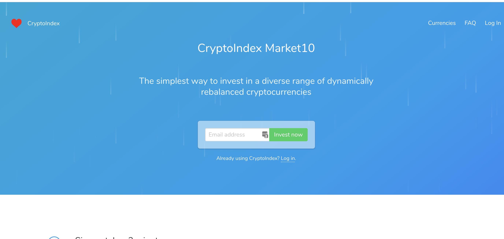

# CryptoIndex Home

CryptoIndex is a Ruby on Rails platform for compiling cryptocurrency indexes and
allowing users to buy dynamically rebalanced portfolios. The product was never
launched so its code has been open-sourced in case it proves a useful starting
point for programmers attempting to solve similar problems in future.



- [Features](#installation)
- [Installation](#installation)
- [Data Model](#data-model)
- [Infrastructure](#infrastructure)
- [Security Model](#security-model)
- [Project Management](#project-management)
- [Linting](#linting)
- [Testing](#testing)
- [Performance Testing](#performance-testing)
- [Legal](#legal)

## Features

- calculate cryptocurrency index values based on pricing data the server gathers
- accept deposits from users in Ether
- assembles a portfolio of cryptocurrencies corresponding to the index for each user
- execute trades on Binance
- rebalance portfolios once a month
- super basic KYC (phone confirmation/crappy address confirmation)

## Installation

_Assumptions: You are on a Mac and using `nvm`._

- Install Bundler and Foreman:

  ```
  $ gem install bundler
  $ gem install foreman -v 0.84
  ```

- Run Bundler:

  ```
  $ bundle install
  ```

- Install Yarn:

  ```
  $ brew install yarn --without-node
  ```

- Download Yarn packages:

  ```
  $ yarn install
  ```

- Initialize the local database:

  ```
  $ rails db:setup
  ```

- Install Redis and configure to run at login:

  ```
  $ brew install redis
  $ brew services start redis
  ```

- _Optional:_ Install [Ganache CLI](https://github.com/trufflesuite/ganache-cli):

  ```
  $ yarn global add ganache-cli
  ```

- Run Foreman:

  ```
  $ foreman start
  ```

- Open `localhost:3000` in your favorite browser.

### Git Hooks

We store a pre-push Git hook in `./git-hooks`. Install with:

```
$ cp ./git-hooks/pre-push .git/hooks/
$ chmod +x .git/hooks/pre-push

# Install dependency `ag` (The Silver Searcher)
$ brew install ag
```

_Note:_ The pre-push Git hook does not run the RSpec system tests. You can run them by typing `bin/rspec` manually. Please make sure to do so periodically.

### Blockchain Testing

In the `development` and `test` environments, our wallets are seeded with the mnemonic:

    'nominee relief private cruise shoe pudding master spike gospel few creek hungry'

A handy external tool for verifying derived addresses, public keys, and private keys can be found [here](https://iancoleman.io/bip39/).

#### Sending Deposits

To send a deposit in the `development` environment, e.g., run:

```rb
Blockchains::Ethereum::Network.send_transaction(
  private_key: '11d0a1403641ae0758aec808d479ba39992fe7761d0086ae46cd4b5bbce7c2e5',
  from_address: '0x334670deb29fd28ea713c8c6565040a87c2b5217',
  to_address: '0xb6efbdd4515e63eb2080a83385748170209c1313',
  nonce: 0,
  value: 100
)
```

Note that in order to send a transaction from another address, you'll need to update the `private_key` as well as the `from_address`.

In this example, `from_address` refers to the `first_user`'s Ethereum account from `config/data/blockchains/ganache/accounts.csv`, and `to_address` refers to the first deposit address generated by the system.

### Rails Credentials

We maintain an unencrypted `config/credentials.yml` in addition to the encrypted `config/credentials.yml.enc` file. Please make sure that they always have the same structure and sequence of entries.

#### Merge Conflicts

Merge conflicts in the encrypted credentials file can be annoying.

The following workflow usually helps:

```
$ git checkout --theirs config/credentials.yml.enc
$ rails credentials:show | $EDITOR

$ git checkout --our config/credentials.yml.enc
$ rails credentials:edit
```

Then carefully compare the two versions and save a new version of the combined credentials file.

## Data Model

### Currencies

The `Currency` model represents a cryptocurrency.

Currencies are carefully curated and whitelisted as part of the `config/currencies.csv` file. Only whitelisted currencies are included in our indexes, traded on exchanges, and held within our storage systems.

Currencies have a `trackable_at` date.

They may also be rejected: In this case, the `rejected_at` date indicates the first timestamp the currency has been disregarded at. We reject currencies such as The DAO in order to protect users from harmful investments, and similarly exclude stablecoins and other assets that are not suitable long-term investments. Rejected currencies are neither tracked nor traded, and we sell off existing holdings of a to-be-rejected currency before the `rejected_at` date.

### Valuations

The `Valuation` model represents the market value of a cryptocurrency at a specific timestamp.

A valuation is associated with one or more `Valuation::Reading` instances which provide the raw data from an industry source such as CoinMarketCap. It also has a `Valuation::Indicator` which adds further information such as the 24-hour moving averages for a number of its attributes.

Valuations form the basis of our cryptocurrency index allocations. By default, they are automatically created for the past month in development. Check out `config.settings.bootstrap` in `development.rb` to change the default behavior.

In order to create the valuations for all currencies for yesterday and today, run:

```
$ rails valuations:create
```

In order to create the valuations for all currencies on January 1st, 2018, run:

```
$ rails valuations:create[2018-01-01]
```

In order to create the valuations for all currencies for the entire month of January 2018, run:

```
$ rails valuations:create[2018-01-01,2018-01-31]
```

In order to scan all valuations gathered in 2018 for missing data, run:

```
$ rails valuations:validate[2018-01-01,2018-12-31]
```

In order to automatically try and create missing valuations, you can run the validation with the `repair=true` option:

```
$ rails valuations:validate[2018-01-01,2018-12-31,repair=true]
```

Valuations readings are immutable.

Valuations are immutable once an index has been allocated at that timestamp.

### Indexes

The `Index` model represents a weighted and capped cryptocurrency index.

Indexes are the lifeblood of CryptoIndex's investment platform. We enable investors to invest in the whole market with a long-term perspective. Indexes have a fixed `number_of_components`. They also have a `minimum_component_weight` in order to make sure that a certain minimum position of each currency is held and a `maximum_component_weight` in order to make sure that no single currency dominates the overall index.

An index is associated with a single `Index::Allocation` instance for each timestamp which in turn represents a collection of `Index::Component` instances. The latter represent the currencies included in the index together with their respective `weight`. The weights always add up to 1.0 for every allocation.

An index allocation's `value` is defined as the sum of the market capitalizations of each component by the divisor of the index. The divisor is defined as the sum of the market capitalizations of each component of the index's genesis allocation on January 1st, 2017.

In order to create the allocations for all indexes for yesterday and today, run:

```
$ rails allocations:create
```

In order to create the allocations for all indexes on January 1st, 2018, run:

```
$ rails allocations:create[2018-01-01]
```

In order to create the allocations for all currencies for the entire month of January 2018, run:

```
$ rails allocations:create[2018-01-01,2018-01-31]
```

Index allocations and their components are immutable.

## Linting

We use [RuboCop](http://batsov.com/rubocop/) for Ruby, [ESLint](https://eslint.org) for JavaScript, [ShellCheck](https://github.com/koalaman/shellcheck) for shell scripts, and [Stylelint](https://stylelint.io) for Sass.

### Setup

- `rubocop` is part of the `:development` group in `Gemfile`.
- `shellcheck` can be installed using `$ brew install shellcheck`.
- `eslint` and `stylelint` are part of the `devDependencies` in `package.json`.

### Rule Sets

- RuboCop: `.rubocop.yml`
- ESLint: `.eslintrc` and `.eslintignore`
- Stylelint: `stylelint.config.js`

### Linting from the Command Line

We enforce linting via Git hooks, although it's possible to run them individually:

_Ruby:_

```
$ bin/rubocop
Inspecting X files
.....................................

X files inspected, no offenses detected
$
```

_JavaScript:_

```
$ bin/eslint
$
```

_Shell scripts:_

```
$ bin/shellcheck
$
```

_Sass:_

```
$ bin/stylelint
$
```

## Testing

Ruby tests should generally be run with `bin/rspec`. This wrapper adds blockchain support to the tests. Individual tests not tagged with `mining` can be run with the unwrapped `rspec` command and will execute more quickly.

### Code Coverage

By default, the generation of code coverage is switched off. To generate a report, run the tests with:

```
$ COVERAGE=true bin/rspec
```

The results can then be viewed with:

```
open coverage/index.html
```

_Note: This only reports on code coverage in Ruby files. No information is given about code coverage with respect to our front-end._

### Fixtures

#### Generation

Our fixture files are generated dynamically with the `fixture_builder` gem, which is configured via a file of the same name. You can regenerate the fixtures with:

```
$ rails db:fixtures:regenerate RAILS_ENV=test
```

#### Goals

1. _Minimize the amount of data._ This is done by reusing the same currency symbols where possible and by minimizing the number of timestamps we cover with data (e.g. for valuations, compositions, etc.). When writing an integration test, it's generally necessary to freeze time to something like `Fixtures::DEFAULT_TIMESTAMP` or some other timestamp known to have comprehensive data.

2. _Have deterministic pricing data that can be tested against._ These are contained in the file `spec/support/fixtures.rb` The main purpose of this is to allow us to write tests in terms of invariant prices. Doing so insulates the integration tests from breaking when we modify the fixtures.

```
# bad (hard-coded style)
expect(btc_market_cap).to eq(8200.04)

# good (invariant style)
expect(btc_market_cap).to eq(Fixtures.market_cap_for('BTC', Time.now))
```

3. _Have users with intelligently named email addresses._ We choose names according to the actions users have taken in the system (and the corresponding fixtures available for them), e.g. `deposited@crypto-index.com`, `rebalanced@crypto-index.com`.

4. _Tell a somewhat realistic story with the data._ For example, pricing data and the contents of the indexes should roughly match the real world at the testing timestamps.

5. Avoid the need to mock `ActiveRecord` in integration tests.

### Tags

- `qa` - Tests that, while important for _quality assurance (QA)_, do not need to be run frequently.

- `ethereum` - Tests that require mining on the _Ethereum_ blockchain.

### Quirks

The application is highly dependent on time, therefore freezing of time needs to be micro-managed throughout the tests.

Be aware of:

1. Currency availability via `trackable_at`, `rejected_at`, etc.

2. Calls to `Time.now` (e.g. in `Compositions::Create`) that cut off data creation

3. Any time scopes that scan for `before_x` or `after_x`

4. Qny wait periods (e.g. `WAIT_INTERVAL`, `REFERENCE_INTERVAL`, `RECENT_INTERVAL`)

5. Expectations that pricing data is available at certain timestamps (e.g. `Valuation::Indicator::MINIMUM_NUMBER_OF_PRIOR_VALUATIONS`)

6. Time-dependent levying of CryptoIndex fees (pre- vs. post-`LAUNCH_DATE`)

## Performance Testing

### RAM and CPU Usage (`development`)

First enable caching with

```
$ rails dev:cache
```

#### Testing for a Memory Leak

Run the following command, gradually increasing the `TEST_COUNT` up to however
many thousands are needed. A file will be generated in the `/tmp` directory
detailing memory usage over time.

In this example, the path `/currencies` will be hit:

```
$ TEST_COUNT=10 DISABLE_SPRING=1 PATH_TO_HIT=/currencies RAILS_ENV=development bundle exec derailed exec perf:mem_over_time
```

#### Testing Object Generation in Memory

Again, testing the path `/currencies`:

```
$ TEST_COUNT=10 PATH_TO_HIT=/currencies RAILS_ENV=development bundle exec derailed exec perf:objects
```

#### Testing CPU Performance

This command tells you which methods were consuming the most CPU resources:

```
TEST_COUNT=5 PATH_TO_HIT=/currencies RAILS_ENV=development bundle exec derailed exec perf:stackprof
```

#### Testing Memory Required by Gems

This command need only be run with `TEST_COUNT=1`:

```
$ RAILS_ENV=development bundle exec derailed bundle:mem
```

### Postgres (`production`)

Most of this section assumes you have enabled the [Heroku pg-extras plugin](https://github.com/heroku/heroku-pg-extras).

```
$ heroku plugins:install heroku-pg-extras
```

#### Index Hit Ratio

Measures how often Postgres can use indexes as opposed to having to scan the entire table, an incredibly slow operation:

```
$ heroku pg:index-usage
```

#### Cache Hit Ratio

Measures how often Postgres has the desired table data/indexes/query execution plans etc. cached in RAM, as opposed to having to hit the hard drive. Anything below 0.99 is generally seen to be indicative of insufficient RAM:

```
$ heroku pg:cache-hit
```

#### Locks

Describes the locks currently granted. Helps to debug deadlock situations:

```
$ heroku pg:locks
```

#### Most Time-Consuming Queries

Lists the top ten most time-consuming commands and the number of times they were called:

```
$ heroku pg:outliers
```

## Legal

### MIT License

Copyright 2018 Jack Kinsella

Permission is hereby granted, free of charge, to any person obtaining a copy of this software and associated documentation files (the "Software"), to deal in the Software without restriction, including without limitation the rights to use, copy, modify, merge, publish, distribute, sublicense, and/or sell copies of the Software, and to permit persons to whom the Software is furnished to do so, subject to the following conditions:

The above copyright notice and this permission notice shall be included in all copies or substantial portions of the Software.

THE SOFTWARE IS PROVIDED "AS IS", WITHOUT WARRANTY OF ANY KIND, EXPRESS OR IMPLIED, INCLUDING BUT NOT LIMITED TO THE WARRANTIES OF MERCHANTABILITY, FITNESS FOR A PARTICULAR PURPOSE AND NONINFRINGEMENT. IN NO EVENT SHALL THE AUTHORS OR COPYRIGHT HOLDERS BE LIABLE FOR ANY CLAIM, DAMAGES OR OTHER LIABILITY, WHETHER IN AN ACTION OF CONTRACT, TORT OR OTHERWISE, ARISING FROM, OUT OF OR IN CONNECTION WITH THE SOFTWARE OR THE USE OR OTHER DEALINGS IN THE SOFTWARE.

### Additional warnings

- You are free to use the CryptoIndex code under the MIT license, but not necessarily any libraries we include. It is therefore your responsibility to ascertain whether any licensing restrictions apply to the ruby/node/other libraries used.

- The code is provided for non-production demo purposes. It is your responsibility to check for legality issues with regards to deploying in a real system.
